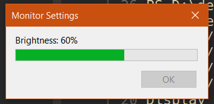

# monadj

Adjust the brightness of your DDC/CI compatible monitors using [winddcutil.exe](https://github.com/scottaxcell/winddcutil)

## Usage

To decrease the brightness by 10%: 
```
monadj.exe -10  
```

You can use it in your AutoHotkey scripts.

```
PgUp::
Run, monadj.exe 10
Return


PgDn::
Run, monadj.exe -10
Return

```

## Build

You should build as follows to run it without a console window

```
go build -o monadj.exe -ldflags="-H windowsgui" main.go
```


